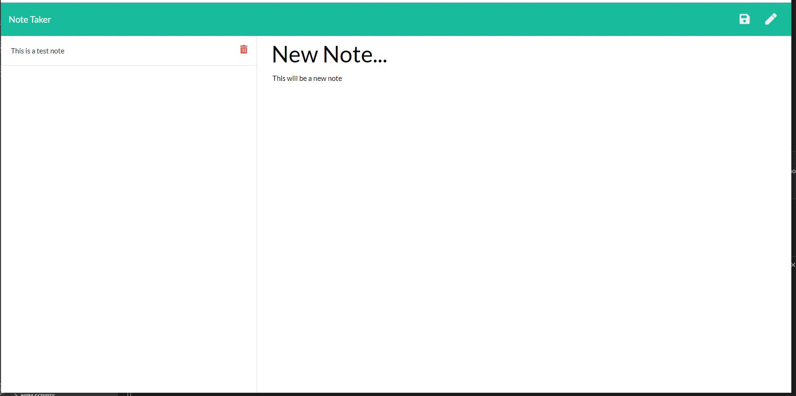

# 09_Note_Taker
- [Description](#Description)
- [Technologies-Libraries](#Technologies-Libraries)
- [Screenshots](#Screenshots)
- [Link](#Link)
​
### Description
This assignment involved accepting information from the webpage, storing it to a file and returning the results to the client side. We also had to run this within our own node.js server using express. The server side routes the file and folder paths along with handlein the get, post and delete commands for handling the user information into and out of the server side.

### Technologies-Libraries
- [NodeJS](https://nodejs.dev/) - Server side code
​
### Screenshots
​

​
### Link
Check it out! 
https://github.com/chrisneal72/09_Note_Taker
https://evening-badlands-03747.herokuapp.com/